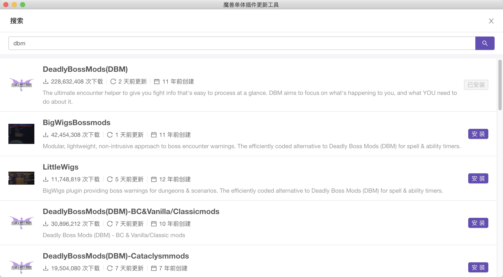

### 魔兽世界插件更新工具

- 由于twitch在中国被墙，一个简体中文版本的魔兽世界插件更新

#### 应用下载

* 1.0.3
 1.使用typescript重构客户端代码，优化了非常多体验性问题
 2.优化了各种加载失败导致需要重试问题，现在增加体验重试都不会完全重启客户端了
 3.后期会实现打开应用列出当前需要更新的插件,以及更新客户端皮肤的风格

* 1.0.2 [win7/win10](https://pan.baidu.com/share/init?surl=-853kn4CgSJg1xPSNjD2qA) 提取码ffuq [mac](https://pan.baidu.com/s/1QdQZ_VzPAQA_fH0xlbKv1Q) 提取码 6fhi
 1. 修复curse ui 更新导致爬虫失效的问题
 2. 由于curse搜索页面获取不到页码暂时只支持搜索前20个插件了

* 1.0.1 [win7/win10](https://pan.baidu.com/s/1GkRcJi6Gipj3hAy3m8YICA) 提取码vbxv [mac](https://pan.baidu.com/s/1aEP7zVTw5THZAj0RIRZlUQ) 提取码d7ff
 1. 修复首页爬取curse数据超时，下载插件超时强制你更新客户端的问题，支持了重试
 2. 现在可以修改你的wow插件根目录，如果设置错了可以点击底部按钮的设置重新设置你的插件根目录地址
 3. 新增插件搜索功能，保存历史搜索记录方便下次查找

* 1.0.0 [win7/win10](https://pan.baidu.com/s/1l7Hl6oz6jVd4grA3xsnJHQ) 提取码k27j [mac](https://pan.baidu.com/s/1zEcwqrxXmaveK6tuEd3q_Q) 提取码qars

##### 使用说明

1. 第一次使用无法获取到你wow已经安装的插件，技术能力有限
2. 在插件列表找到你安装过的可以再次在这个工具里安装一次就会有历史安装插件记录方便更新和移除
3. 确保你的网络能访问到[curse](https://www.curseforge.com/wow/addons)
4. 此工具个人使用，请不要使用商业上

##### 工具截图

